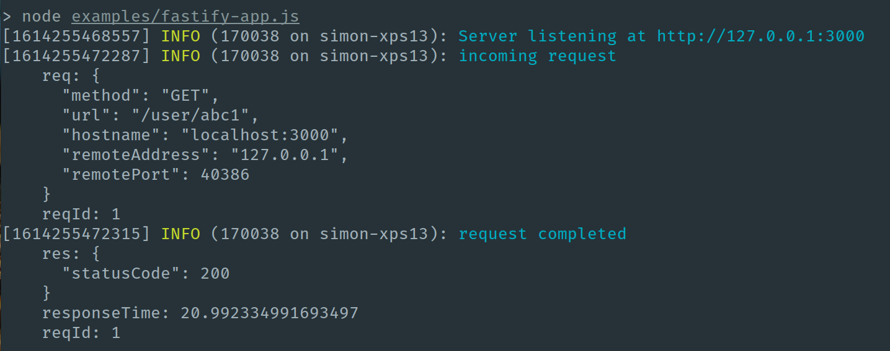

class: center, middle


# Make the most of modern<br> JavaScript with Fastify

### @simonplend

---

# What we're going to cover in this talk

- **What is Fastify?**

- **Promises and async / await in Node.js**

- **Node.js frameworks and async code**
	- Support matters
	- Framework support

- **Fastify and async code**

- **Hands on async code**

- **Out-of-the-box**
	- Plugins
	- Validation
	- Logging

- **Get started with Fastify**

---

# What is Fastify?


### "Fast and low overhead web framework, for Node.js"

- **Lean core** - Use plugins to add functionality.

- **Native support for async code** - Promises and `async` / `await`.

- **Two key features out-of-the-box** - Validation and logging.

- **Developer friendly** - Designed to be expressive, TypeScript support.

- **Fast (subtle clue in the name!)** - Fastest Node.js framework available today.

- **Production ready** - Being used at scale.

???

Written in vanilla JavaScript, includes full TypeScript type definitions.

Type hinting if your code editor supports it.

-

Fastify site has benchmarks.

Your framework should not be your bottleneck.

-

Being used for Covid Green Exposure Notification API Service.

Ireland, Scotland, several US states.

Handling millions of requests per day.

-

Links:

- Benchmarks - https://www.fastify.io/benchmarks/
- Organisations using Fastify - https://www.fastify.io/organisations/

---
# Promises and async / await in Node.js

Node.js has had support for:

- **Promises since v4** (released September 2015)

- **`async` / `await` since v7.6.0** (released February 2017)

Now widely used across the Node.js ecosystem.

???

Callback hell has pretty much gone away.

Messy promise chains no longer necessary.

I'm going to refer to Promises and async/await collectively as "async code".

Links:

- v4.0.0 release - https://nodejs.org/en/blog/release/v4.0.0/
- v7.6.0 release with v8 5.5 - https://github.com/nodejs/node/blob/master/doc/changelogs/CHANGELOG_V7.md#7.6.0

---

# Node.js frameworks and async code: Support matters

The Node.js framework you're using should have built-in support for async code.

If it doesn't you're at much greater risk of having unhandled promise rejections.


---

# Node.js frameworks and async code: Support matters

Unhandled promise rejections...

- Can cause **memory leaks** in your application

- Will throw an error and **crash your application** from Node v15.0.0

???

Already an option to make them throw an error, but is the default behaviour
from v15.0.0 onwards.

Very easy to miss error handling.

---

# Node.js frameworks and async code: Framework support

❌ **Express** - No native support.

❌ **Restify** - No native support yet. Support merged mid-2020, slated for a v9 release.

✅ **Koa** - Native support.

✅ **hapi** - Native support.

✅ **Sails.js (full stack)** - Native support.

✅ **Nest (full stack)** - Native support, but likely patching Express. Can use with Fastify.

???

Not an exhaustive list.

Support for async code is mixed.

Surprisingly difficult to figure out which Node.js frameworks natively support
async code.

Async code support shouldn't be only deciding factor in framework you choose,
but think it should be a minimum requirement.

Express most popular framework. Not been a release of Express for almost 2 years now. Hacky support for async code can be patched in.

Full stack frameworks opinionated, MVC etc.

---

# Fastify and async code

- Fastify natively handles promises and supports `async` / `await` 🎉

- Routes will catch uncaught rejected promises for you.

- Allows you to write asynchronous code safely.

- Lets you do neat things (send return value as response body):

  ```javascript
  app.get("/user/:id", async (request) => await getUser(request.params.id));
  ```

???

You should still write error handling code, but provides you with a safety net.

Links:

- https://www.fastify.io/docs/latest/Routes/#async-await
- https://www.fastify.io/docs/latest/Reply/#async-await-and-promises
- https://www.fastify.io/docs/latest/Errors/#catching-errors-in-promises

---

# Hands on async code

Let's look at how Express and Fastify behave with async code 👀

???

Get a better understanding of behaviour of async code in Node.js frameworks.

Express has no native support.
Fastify has full async support.

Switch to VS Code and terminal.

Steps with `express-app.js`:

- curl request
- Change `getUser()` to reject
- curl request
- Add `catch` block, pass error to `next()`
- curl request

Steps with `fastify-app.js`:

- curl request
- Change `getUser()` to reject
- curl request
- Add `catch` block, add `reply.status(500);`
- curl request

Optional:

- Add `statusCode = 404` to error and `throw error`
- Change `getUser()` to resolve
- Refactor route to a one-liner
- curl request

---

# Out-of-the-box

Some of the other things which Fastify gives you:

- **Plugins**

- **Validation**

- **Logging**

---

# Out-of-the-box: Plugins

### Fundamental concept: Everything is a plugin.

- Plugins have their own **scope**.

- Plugins can contain **routes** or customise core Fastify objects with **"decorators"**.

- To use plugins you **register** them:
  
  ```javascript
  app.register(async (app, options) => {
    
  	app.decorate("yolo", () => {
  		return { yo: "lo" };
  	});
  
  	app.get("/yolo", async (request, reply) => {
  		reply.send(app.yolo());
  	});
  
  });
  ```

???

Example code so far with Fastify has been simplified, with a single route.

Everything is middleware in Express.

Plugin scope encourages a separation of concerns.

Encourages structure, but doesn't enforce it.

---

# Out-of-the-box: Validation

- **Request validation** - Uses Ajv (Another JSON schema validator).

- **Define validation rules with JSON Schema** - Compiled to ES6 code, helps make them very fast.

  ```javascript
  const schema = {
  	body: {
  		type: "object",
  		required: ["first_name"],
  		properties: {
  			first_name: { type: "string", minLength: 1 }
  		}
  	}
  };
  
  app.post("/user", { schema }, async (request, reply) => {
  	reply.send(request.body);
  });
  ```

  ```json
  {
  	"statusCode": 400,
  	"error": "Bad Request",
  	"message": "body should have required property 'first_name'"
  }
  ```

???

Links:

- https://www.fastify.io/docs/latest/Validation-and-Serialization/

---

# Out-of-the-box: Logging

- **Logging often causes performance issues** - e.g. Serializing and transporting data elsewhere.

- **Logging fully integrated** - No need to spend time choosing and integrating a logger,
Fastify uses a fast and flexible logger: `pino`
  
  

???

Links:

- https://www.fastify.io/docs/latest/Logging/

---

# Get started with Fastify

- **Extensive documentation**
	- [fastify.io/docs/latest/](https://www.fastify.io/docs/latest/)

- **Rich ecosystem of plugins**
	- [fastify.io/ecosystem/](https://www.fastify.io/ecosystem/)

- **Example application** - Showing core Fastify concepts, best practices and recommendations.
	- [github.com/delvedor/fastify-example](https://github.com/delvedor/fastify-example)

- **Plugin to help ease migration from Express**
	- [fastify-express](https://github.com/fastify/fastify-express)

- **Community Discord server**
	- [discord.gg/D3FZYPy](https://discord.gg/D3FZYPy)

---

class: center, middle

# THE END

---

class: center, middle

# Thank you for watching

## 🙇

I blog about Node.js at [simonplend.com](https://simonplend.com)

I send out a [weekly-ish newsletter](https://simonplend.com/newsletter/)<br .>
to help you build better Node.js applications.

## 👋

Follow me on Twitter [@simonplend](https://twitter.com/simonplend)
